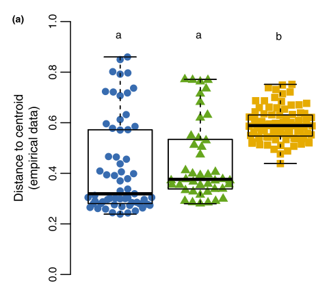

```{r setup.1, include=FALSE}
knitr::opts_chunk$set(echo = FALSE, warning = FALSE, cache = TRUE, message = FALSE)
```

```{r setup.2, warning = FALSE, include = FALSE, cache = TRUE}
library(data.table)
library(ggmap)
library(ggplot2)
library(ggplotify)
library(grid)
library(gridExtra)
library(TDA)
library(TDAstats)
library(phyloseq)
library(phylosmith)
library(plotly)
library(reshape2)
library(stringr)
library(tidyverse)
library(vegan)

source('./src/pommier.R')

theme_set(theme_light())

```

This page contains my current progress using persistent homology analysis based on the dataset from the study [*Dispersal enhances beta diversity in nectar microbes*](https://www.ncbi.nlm.nih.gov/pubmed/28597955) by [Rachel Vanette](http://entomology.ucdavis.edu/Faculty/Rachel_Vannette/) and [Tadashi Fukami](https://web.stanford.edu/~fukamit/). 

# Introduction

The original study by Vanette and Fukami investigated the effect of dispersal on the diversity of the microbial communities of the *Mimulus aurantiacus* flower found in Jasper Ridge Biological preserve. In particular, they wanted to see how varying levels of dispersal affects beta diversity, the "the variation in species composition among local communities." Increasing opportunities for dispersal between microbial communities within a region are thought to have a homogenizing effect on the communities as the members of individual communities are free to move between the communities. Thus, over time, the communities within the region will all be more and more identical, thus decreasing beta diversity.

To study this, Vanette and Fukami, manipulated dispersal opportunities to the floral nectar of *Mimulus aurantiacus*. The floral nectar of *M. aurantiacus* is initially sterile (owing to the high sugar content), and the main dispersal vector of microbes into this nectar is via *Calypte anna*, or Anna's hummingbird. These conditions make it an ideal system to study the effects of dispersal on beta diversity.

The flowers were separated into three treatment groups. These treatments, in order of decreasing dispersal opportunity, are: exposed flowers, with no barriers to dispersal; caged flowers, which prevented hummingbirds from accessing the flowers; and caged flowers, which prevented hummingbirds and insects from accessing the plants, leaving wind as the only dispersal vector to the affected flowers. These flowers were located in various places across Jasper Ridge Biological Preserve. The figure below has some sample locations.

```{r load.data}
nectar <- readRDS("./data/bacteria_phyloseq.RDS")
nectar.sample_data <- nectar@sam_data %>% 
  add_count(Treatment) %>% 
  mutate(Treatment_n = paste0(Treatment, " (", n, ")"))

if (!file.exists("./data/jrbp.map.rds"))
{
  jrbp.map <- get_map(location = c(lon = mean(nectar.sample_data$longitude), 
                                   lat = mean(nectar.sample_data$latitude)), zoom = 17, 
                      maptype = "satellite", scale = 2)
  saveRDS(jrbp.map, "./data/jrbp.map.rds")
} else {
  jrbp.map <- readRDS("./data/jrbp.map.rds")
}

```

```{r jrbp.map.1, include = FALSE, warnings = FALSE}
jrbp.plot <- ggmap(jrbp.map) + 
  geom_point(data = nectar.sample_data,
             aes(x = longitude, y = latitude, fill = Treatment_n), 
             size = 1.75, shape = 21, alpha = 0.5) +
  labs(x = "", y = "", fill = "Treatment (n)",
       title = "M. aurantiacus sample locations at JRBP"
       ) +
  theme(axis.ticks = element_blank(), axis.text = element_blank(),
        legend.title = element_blank())
```

```{r jrbp.map.2}
ggplotly(jrbp.plot,
         tooltip = c("latitude", "longitude", "treatment"))
```


*(To add: data collection, bioinformatics methods)*

They calculated the beta diversity of the microbial communities in each treatment by using the multivariate method based on dissimilarity matrices as defined by [Legendre and Caceres](https://onlinelibrary.wiley.com/doi/full/10.1111/ele.12141). The authors found that the beta diversity of the floral nectar microbial communities in the exposed treatment group was higher than in the treatment groups with lower opportunity for dispersal. While the authors outline several reasons why increased dispersal may increase beta diversity, this is still a surprising result given how intuitive the idea of dispersal having a homogenizing effect on beta diversity is.




*(To add: review of persistent homology)*

I'm interested in applying persistent homology to microbial communities. A significant challenge for persistent homology is to relate the analysis back to the system of study. For example, in protein structure analysis (and other systems where spatial structure is important), a loop in the dataset might literally be a loop in the protein structure of study. But what do these topological structures represent in a microbial community? 

This system in particular is interesting because there is a clear signal to detect - the exposed treatment has more beta diversity than the other two treatments, which are very similar in terms of beta diversity. Can persistent homology detect this same signal? And can we use this as a starting point to help us interpret what these bars mean in the context of microbial communities?

# Barcodes

The dataset is an abundance matrix $O$ of 3591 taxa by 195 samples. Thus, each sample $j$ is a point in $\mathbb{R}^{3591}$, and each $O_{ij}$ is the integer count of OTU $i$ observed in sample $j$. Then, all those taxa with 0 observations across all columns were removed, and all columns with 0 abundances across all rows were removed, leaving us with a new abundance matrix $O'$ with 3401 taxa and 194 samples. Then, I calculated the persistent homology for each treatment, using the Bray-Curtis dissimilarity measure as the metric. Below are the persistence diagrams for the bagged and caged treatments:

```{r load.nectar_by_treatment}
nectar.by_treatment.bray <- get_persistence_list(nectar, "Treatment")
```


```{r all.treatments, include = FALSE}
nectar.homology <- get_homology_from_phyloseq(nectar)
plot_barcode(nectar.homology) + 
  labs(x = "Nectar") +
  # xlim(0, 4) + 
  theme(axis.text = element_blank(), axis.ticks = element_blank())
```

```{r barcode.caged.1, warning = FALSE}
barcode.caged <- plot_barcode(nectar.by_treatment.bray$Caged$hom) + 
  labs(colour = "", x = "Caged samples") +
  expand_limits(x = 1) + 
  theme(#axis.text = element_blank(), axis.ticks = element_blank(),
        legend.position = "none") +
  scale_x_continuous(breaks = c(0, 1))
```

```{r barcode.caged.2}
barcode.bagged <- plot_barcode(nectar.by_treatment.bray$Bagged$hom) + 
  labs(colour = "", x = "Bagged samples") +
  theme(#axis.text = element_blank(), axis.ticks = element_blank(),
        legend.position = "none")  +
  scale_x_continuous(breaks = c(0, 1))
```

```{r combined.barcodes}
grid.arrange(barcode.caged, barcode.bagged, ncol = 2,
             top =  "Barcode diagram of microbial communities")
```

The two diagrams above are very similar. In the first dimension, the barcodes have a similar shape, and there is a little smattering of second dimensional features. The similarity in the barcode diagrams might reflect the similarity in beta diversity between the two treatments. As shown in the figure above, the beta diversity found in the caged and bagged treatments were very similar to each other. 

Of note is that the bagged samples have noticably more 1st-dimension barcodes than the caged samples. While there could be a meaningful biological reason for this, I believe the more numerous barcodes are just due to the fact that there are more bagged samples (104) than caged samples (73).

Below is the barcode diagram for the exposed treatment.

```{r barcode.exposed}
plot_barcode(nectar.by_treatment.bray$Exposed$hom) + 
  labs(colour = "", x = "Exposed samples", 
       title = "Barcode diagram of microbial communities") +
  theme(#axis.text = element_blank(), axis.ticks = element_blank(),
        legend.position = "none",
        plot.title = element_text(hjust = 0.5)) +
  scale_x_continuous(breaks = c(0, 1))
```


# Permutation tests

```{r load.perm}
if (!file.exists("./data/nectar.bray.perm_tests")){
  nectar.bray.perm_tests <- get_pairwise_permutation_tests(nectar.by_treatment.bray, 
                                                           iters = 1500)
  saveRDS(nectar.bray.perm_tests, "./data/nectar.bray.perm_tests")
} else {
  nectar.bray.perm_tests <- readRDS("./data/nectar.bray.perm_tests")
}
```


```{r perm_heatmap.dim_1}
get_dimension_heatmap(nectar.bray.perm_tests, dimension = 1, triangle = TRUE) +   
  labs(title = "Dimension 1", subtitle = element_blank()) +
  theme(plot.title = element_text(hjust = 0.5))
```

```{r perm_heatmap.dim_2}
get_dimension_heatmap(nectar.bray.perm_tests, dimension = 2, triangle = TRUE) + 
  labs(title = "Dimension 2", subtitle = element_blank()) +
  theme(plot.title = element_text(hjust = 0.5)) 
```

This is 