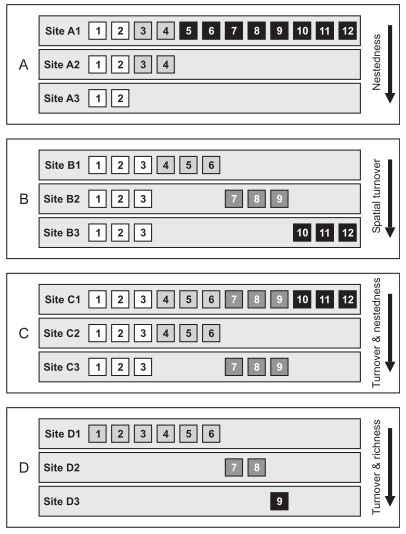

```{r setup.1, include=FALSE}
knitr::opts_chunk$set(echo = FALSE, warning = FALSE, cache = TRUE, message = FALSE)
```

```{r setup.2, warning = FALSE, include = FALSE, cache = TRUE}
library(data.table)
library(ggmap)
library(ggplot2)
library(ggplotify)
library(grid)
library(gridExtra)
library(TDA)
library(TDAstats)
library(phyloseq)
library(phylosmith)
library(plotly)
library(reshape2)
library(stringr)
library(tidyverse)
library(vegan)

source('./src/pommier.R')

theme_set(theme_light())

```

An overview of community structures in microbial ecology.

Borrowing heavily from [Partitioning the turnover and nestedness components of beta diversity](https://onlinelibrary.wiley.com/doi/full/10.1111/j.1466-8238.2009.00490.x) by Andres Baselga.

## Simulating communities

Start off with basic examples from Baselga's paper. Starting by reproducing these structures:



## Situation A: Nestedness

```{r baselga_sim.A}
site_A1 <- rep(1, 12)
site_A2 <- sim.sample.contig_presence(12, 4)
site_A3 <- sim.sample.contig_presence(12, 2)

sim_A.otu_table <- otu_mat_from_lists(site_A1, site_A2, site_A3)

sim_A.tax_mat <- sim.sample.tax_info(nrow(sim_A.otu_table))

sim_A.sample_data <- sim.sample.treatment_data(sim_A.otu_table)

sim_A.physeq <- phyloseq(otu_table(sim_A.otu_table, taxa_are_rows = TRUE), 
                         tax_table(sim_A.tax_mat),
                         sim_A.sample_data)


```


```{r baselga_sim.A.plot}
plot_communities(sim_A.physeq@otu_table) + 
  labs(title = "Simulation A: Nestedness",
       subtitle = "The observed microbiome of Site A3 (resp. A2) is a proper subset of the observed microbiome \n in Site A2 (resp. A1)")
```


```{r baselga_sim.A.hom}
sim_A.homology <- get_homology_from_phyloseq(sim_A.physeq)
plot_barcode(sim_A.homology)
```


## Situation B: Spatial turnover

```{r, baselga_sim.B}
site_B1 <- sim.sample.contig_presence(12, 6)
site_B2 <- c(sim.sample.contig_presence(6, 3), sim.sample.contig_presence(6, 3))
site_B3 <- c(sim.sample.contig_presence(9, 3), rep(1, 3))

sim_B.otu_table <- otu_mat_from_lists(site_B1, site_B2, site_B3)

sim_B.tax_mat <- sim.sample.tax_info(nrow(sim_B.otu_table))

sim_B.sample_data <- sim.sample.treatment_data(sim_B.otu_table)

sim_B.physeq <- phyloseq(otu_table(sim_B.otu_table, taxa_are_rows = TRUE), 
                         tax_table(sim_B.tax_mat),
                         sim_B.sample_data)

```

```{r baselga_sim.B.plot}
plot_communities(sim_B.otu_table) +
  labs(title = "Simulation B: Turnover",
       subtitle = "The three sites have the same richness and share some common species, but...")
```

```{r baselga_sim.B.hom}
sim_B.homology <- get_homology_from_phyloseq(sim_B.physeq)
plot_barcode(sim_B.homology)
```


## Situation C: Turnover and nestedness

```{r, baselga_sim.C}
site_C1 <- rep(1, 12)
site_C2 <- sim.sample.contig_presence(12, 6)
site_C3 <- c(sim.sample.contig_presence(6, 3), sim.sample.contig_presence(6, 3))
sim_C.otu_table <- otu_mat_from_lists(site_C1, site_C2, site_C3)

sim_C.tax_mat <- sim.sample.tax_info(nrow(sim_C.otu_table))

sim_C.sample_data <- sim.sample.treatment_data(sim_C.otu_table)

sim_C.physeq <- phyloseq(otu_table(sim_C.otu_table, taxa_are_rows = TRUE), 
                         tax_table(sim_C.tax_mat),
                         sim_C.sample_data)

```

```{r baselga_sim.C.plot}
plot_communities(sim_C.otu_table) +
  labs(title = "Simulation C: Turnover and nestedness",
       subtitle = "The three sites have the same richness and share some common species, but...")
```

```{r baselga_sim.C.hom}
sim_C.homology <- get_homology_from_phyloseq(sim_C.physeq)
plot_barcode(sim_C.homology)
```


## Situation D: Turnover and richness

```{r, baselga_sim.D}
site_D1 <- sim.sample.contig_presence(12, 6)
site_D2 <- c(rep(0, 6), sim.sample.contig_presence(6, 2))
site_D3 <- c(rep(0, 8), sim.sample.contig_presence(4, 1))
sim_D.otu_table <- otu_mat_from_lists(site_D1, site_D2, site_D3)

sim_D.tax_mat <- sim.sample.tax_info(nrow(sim_D.otu_table))

sim_D.sample_data <- sim.sample.treatment_data(sim_D.otu_table)

sim_D.physeq <- phyloseq(otu_table(sim_D.otu_table, taxa_are_rows = TRUE), 
                         tax_table(sim_D.tax_mat),
                         sim_D.sample_data)

```

```{r baselga_sim.D.plot}
plot_communities(sim_D.otu_table) +
  labs(title = "Simulation D: Turnover and richness",
       subtitle = "The three sites have the same richness and share some common species, but...")
```

```{r baselga_sim.D.hom}
sim_D.homology <- get_homology_from_phyloseq(sim_D.physeq)
plot_barcode(sim_D.homology)
```

## Increasing complexity

Will first start off by increasing number of samples and OTUs.

```{r ic.1}

num_samples = 30
num_otus = 10

sim_1.otu_table <- matrix(sample(1:100, num_samples * num_otus, replace = TRUE), 
                          nrow = num_otus, ncol = num_samples,
                          dimnames = list(paste("OTU", 1:num_otus, sep = "_"), 
                                          paste("Sample", 1:num_samples, sep = "_")))
head(sim_1.otu_table[1:3, 1:10])
```

```{r ic.2}
plot_communities(sim_1.otu_table)
```
